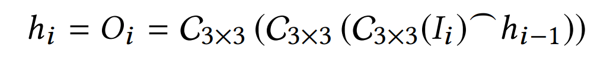

# AI Path Tracer Denoiser

**University of Pennsylvania, CIS 565: GPU Programming and Architecture, Final Project**

- Members: Dewang Sultania & Vaibhav Arcot

- - [Dewang's Linkedin](https://www.linkedin.com/in/dewang-sultania/)
  - [Vaibhav's LinkedIn](https://www.linkedin.com/in/vaibhav-arcot-129829167/)

- Tested on: Windows 10, i7-7700HQ @ 2.8GHz (3.8 Boost) 32GB, External GTX 1080Ti, 11G (personal laptop)

## General Overview

The repo is dedicated to the implementation of the paper titled [Interactive Reconstruction of Monte Carlo Image Sequences using a Recurrent Denoising Autoencoder](https://research.nvidia.com/sites/default/files/publications/dnn_denoise_author.pdf), which proposes a purely ML approach to denoising 1 sample per pixel path tracer renders. The approach takes into account the temporal nature of a moving camera to reduce flickering between the different frames. 

The Path tracer was implemented path tracer written entirely in C++ and CUDA accelerated while the network was created and trained in PyTorch. The inference is done using the C++ bindings of Torch. 

Below is an overview of the pipeline. The black line is the path followed during training and the green line is used during inference.

## Path Tracing Overview

The idea of a path tracer is to simulate the effect light and materials have on other objects in the scene. This path tracer is both the first and last step of this project; data generation and inference are done using similar code. More information can be found on [this repo](https://github.com/Black-Phoenix/Project3-CUDA-Path-Tracer), which is dedicated to the path tracer itself.

### Features

* Reflective and diffused materials
* Stream compaction
* Material sorting
* Caching first bounce
* Refractive materials using Schlick's approximation of Fresnel's law
* Motion blur
* Anti Aliasing
* Normal debugging view
* Loading arbitrary meshes and ray culling
* Experimental MTL file parsing and texture loading
* The output of requisite intermediate buffers

## Cornell Box

The Cornell box is a simple stage, consisting of 5 diffusive walls (1 red, 1 green and the other 3 white). In the above sample, a diffusive sphere.

### Effect of depth on a render

To show the effect of depth on the render, We decided to render a reflective intensive scene. 2 of the walls (red and green) and 6 orbs are reflective, 2 light sources (one is the middle orb), 2 transparent (green) orbs and 1 orb(blue) + 3 walls are diffusive. Because of this setup, the number of remaining rays doesn't reach 0 by a depth of 8, meaning there can be a further improvement (in deeper reflections).

| Depth | Render                   | Comment                                                      |
| ----- | ------------------------ | ------------------------------------------------------------ |
| 1     |   | For this render, we see no reflections at all. The no path tracing case. AKA albedos |
| 2     |   | We start to see some reflections (only the simplest ones).   |
| 3     |   | We can see more reflections on the reflection of the orbs in the walls. |
| 4     |   | We now have better refractions.                              |
| 5     |   | The reflections of the orbs have some transparency.          |
| 6     |  | The reflection of the transparent orbs isn't transparent.    |
| 7     |  | The difference is subtle, but is shows up in the 3rd order reflections |
| 8     |   | We can keep going, but here is a good stopping point.        |

 

### Effect of iterations on a render

To see the effect of iterations on render quality, we went with the same image we used above (with a depth of 8) to test the effect of iteration on render for a semi-complex scene. From visual inspection, 2000 seems to be the tipping point, and further iterations have diminishing value. So for data generation, we chose to use 2500 samples per pixel images as the ground truth. 

| Iterations | Render                    |
| ---------- | ------------------------- |
| 50         |    |
| 250        |   |
| 500        |   |
| 1000       |  |
| 2000       |  |
| 5000       |  |

## Data Generation pipeline

### Movements

One of the core objectives of this project is to denoise temporal data. This means that the camera moves **smoothly** through the scene and for each frame, we generate the requisite inputs. 

So the data generation, we had the camera move around the scene. For each scene, we generated an average of 300 frames of motion and 2 different motions of the camera (pan left-right and pan up-down). Then we generated 5 different versions of the 1 sample per pixel inputs. This was done to allow the network to identify the noise. The total amount of data generated was around 200 gigabytes, and only a subset could be uploaded.

### Components

 To generate training data, we used the path tracer to output the albedos, depth maps, 1 sample per pixel and the normals for each surface for each frame in a movement. This results in a total of 10 channels (It is possible to store the normals as only 2 channels but was not done for this project, because a png has either 3 or 4 channels per image). The images were written to the disk using STB write png. Because all the values are float values, for data storage, we scaled all the outputs to make the range between 0 and 255. While training the network, the data is unscaled. This allowed for saving of space (not required to write cv float arrays to disk) while having a discretization effect on the data. 

### Python processing

After the data was generated in C++ and written to images, we used Numpy to perform the final stage of data processing, which involved collecting the 4 separate images and storing it into a single Numpy matrix with 10 channels. This matrix was then cropped to the requisite size and written to disk as Numpy files. This allowed them to be read using the PyTorch data loader, making it easier to train the network.

## Denoising Network 

### Architecture

The architecture used here is a Recurrent Autoencoder with Skip connections, TL;DR it is recurrent because data is temporal, autoencoder because we need to reconstruct images from some internal representation and skip connections help the network go deeper and fix the vanishing/exploding gradient problem.

#### Denoising Autoencoder with skip connections

The network architecture includes a distinct encoder and decoder stages that operate on decreasing and increasing spatial resolutions, respectively. Autoencoders are networks that learn to reconstruct their inputs from some internal representation, and denoising autoencoders also learn to remove noise from the inputs. The term denoising autoencoders are used because the network constructs from noisy inputs. Because the network learns a mapping from inputs to outputs, it has a desirable property that any number of auxiliary inputs can be provided in addition to the colour data. The optimization during training considers all these inputs and automatically finds the best way to use them to disambiguate the colour data.

#### Recurrent Denoising Autoencoder for Temporal Denoising 

Recurrent Neural networks are used for processing arbitrarily long input sequences. An RNN has feedback loops that connect the output of the previous hidden states to the current ones, thus retaining important information between input. This makes it a good fit for our application for two reasons:

* In order to denoise a continuous stream of images, we need to achieve temporally stable results.
* Our inputs are very sparse, the recurrent connections also gather more information about the illumination over time.

In order to retain temporal features at multiple scales, fully convolutional blocks are used after every encoding stage. It is important for the network to remain fully convolutional because we can train on smaller crops and then later apply it to sequences of arbitrary resolution and length. 

Since the signal is sparser in the encoder than the decoder it is efficient to use recurrence only in the encoder and not the decoder. Each recurrent block consists of three convolution layers with a 3 × 3-pixel spatial support. One layer processes the input features from the previous layer of the encoder. It then concatenates the results with the features from the previous hidden state and passes it through two remaining convolution layers. The result becomes both the new hidden state and the output of the recurrent block. This provides a sufficient temporal receptive field and, together with the multi-scale cascade of such recurrent blocks, allows to efficiently track and retain image features temporally at multiple scales. The convolution layers in a recurrent block operate on the same input resolution and the same number of features as the encoding stage it is attached to. Formally, the output and the hidden state can be represented using a recurrent equation:

#### Loss

A loss function defines how the error between network outputs and training targets is computed during training. The network trained here contains three-loss components:

##### Spatial L1 loss

The most commonly used loss function in image restoration is mean square error loss. However, it has been observed that using an L1 loss instead of L2 can reduce the splotchy artefacts from reconstructed images. 

##### Gradient Domain L1 Loss

The L1 spatial loss provides a good overall image metric that is tolerant of outliers. In order to further penalize the difference in finer details like edges, we also use gradient-domain L1 loss

where each gradient is computed using a High-Frequency Error Norm (HFEN), an image comparison metric. The metric uses a Laplacian of Gaussian kernel for edge-detection. The Laplacian works to detect edges, but is sensitive to noise, so the image is pre-smoothed with a Gaussian filter first to make edge-detection work better.

##### Temporal Loss

These losses minimize the error of each image in isolation. However, they do not penalize temporal incoherence and neither do they encourage the optimizer to train the recurrent connections to pass more data across frames. So along with the other two losses, a temporal L1 loss is used.

where the temporal derivative for an ith pixel image is computed using finite differencing in time between the ith pixels of the current and the previous image in the temporal training sequence.

The final loss is a weighted combination of these three losses as a final training loss.

where ws, wg and wt are picked as 0.8,0.1,0.1 respectively. It was important to assign a higher weight to the loss functions of frames later in the sequence to amplify temporal gradients, and thus incentivize the temporal training of RNN blocks. A Gaussian curve to modulate ws/g/t: for a sequence of 7 images was used with values (0.011, 0.044, 0.135, 0.325, 0.607, 0.882, 1).

## Realtime Architecture

Once we have a trained network, we use the PyTorch to export the network into a c++ readable model using TorchScript. Once this is done, we can load the model and pass the network a tensor to infer on. Because of the way functions are implemented in the C++ Torch lib, the code wasn't able to be compiled with nvcc. So the inference and subsequent visualization was done using OpenCV imshow. This is definitely not the most efficient way to show the frames but was sufficient to get a usable framerate output.

 In the results, 2 different approaches to getting the data into a Torch tensor are shown. The first approach used the existing pipeline for data generation and replaced the final step with a conversion to a torch tensor. This method turned out to be very slow because of a number of small requirements, such as the coordinate frames not lining up and RGB vs BGR issues. 

The second approach was a much cleaner approach, using only float arrays and directly filling the data into the array during generation inside the kernel itself. This method involved removing a lot of the data generation code (in order to make it Realtime), so the data generation code was moved to a separate branch 

## Building the project

### Dependencies

* Path Tracer Code

	* CUDA 10+
  - [tinyobjloader](https://github.com/syoyo/tinyobjloader)
  - [Torch C++](https://pytorch.org/)
  - [CuDNN](https://developer.nvidia.com/cudnn)
  - [OpenCV](https://opencv.org/)
  - [STB](https://github.com/nothings/stb)

- Network Training

  * [PyTorch](https://pytorch.org/)

  - Numpy
  - [OpenCV](https://opencv.org/)

### Building Torch Using CMake (With OpenCV)

- Download [Torch]( https://pytorch.org/tutorials/advanced/cpp_export.html ) From the official website (C++ build with or without CUDA) and extract it into the project
- Download CUDNN (Required for Torch) and extract into the project
- First, add the necessary lines from [this post]( https://pytorch.org/tutorials/advanced/cpp_export.html ) to your CMakeLists.txt file (Already one for this project)
- In the build directory, run CMake-gui .. and point cmake towards the OpenCV build directory (if not already in the path)
- Then close cmake-gui (This is the order because OpenCV is found before Torch) and run the following command (Point it towards the libtorch relative to the build directory)
- cmake -DCMAKE_PREFIX_PATH=$PWD/../../libtorch ..
- Run cmake-gui .. again and now point CUDNN_INCLUDE_PATH towards the include folder inside the CUDNN folder.
- Point CUDNN_LIBRARY_PATH to the library file (/absolute/path/to/CUDNN/lib/x64/cudnn.lib)
- Generate the project

## Results

### Qualitative

### Quantitative

## Bloopers

The above result was obtained when the gradients of the network were exploding. This was resolved using batch normalization.

## Useful links

- [3D obj files with normals](https://casual-effects.com/data/)
- [Fresnel's law](https://blog.demofox.org/2017/01/09/raytracing-reflection-refraction-fresnel-total-internal-reflection-and-beers-law/)
- [Easier 3D obj files](https://graphics.cmlab.csie.ntu.edu.tw/~robin/courses/cg04/model/index.html)
- [C++ Torch API](https://pytorch.org/cppdocs/)